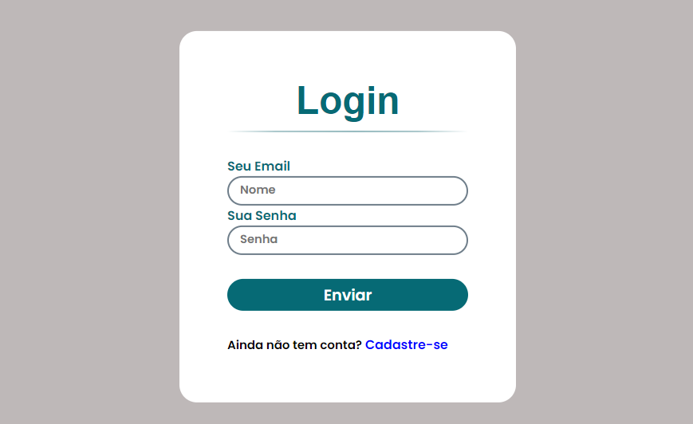
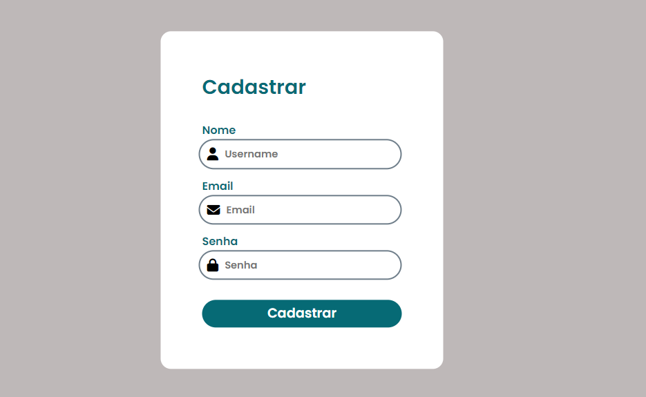

<h1> Projeto login + Formulario de cadastro </a></h1>

  
  

 [Clique aqui para acessar] (https://emmanuel194.github.io/Portif-lio-Pessoal/)
  

<h2>:bookmark_tabs: Descrição</h2>

 Tela de login + cadastro com validação em javascript

